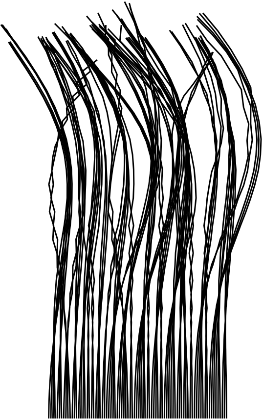
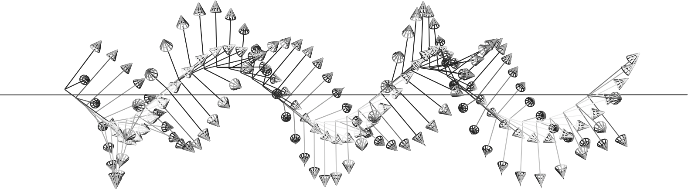
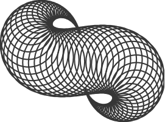

<!-- THIS README IS WRITTEN USING MULTIMARKDOWN -->

CSS: style0.css
	 

Versor (libvsr)
===
A (Fast) C++ library for Conformal Geometric Algebra.  
---
###Currently tested on Linux and Mac OS X

Developer: Pablo Colapinto
wolftype (at) gmail dot com

    As long as algebra and geometry have been separated, their progress have been slow and their uses limited; but when these two sciences have been united, they have lent each mutual forces, and have marched together towards perfection.  
	-Joseph Louis Lagrange

	No attention should be paid to the fact that algebra and geometry are different in appearance.
	-Omar Khayyám

	L’algèbre n’est qu’une géométrie écrite; la géométrie n’est qu’une algèbre figurée.
	-Sophie Germain
	
	If you want to see, learn how to act
	-Heinz von Foerster

## CONTENTS: ##

* [INTRODUCTION](#introduction) 
* [SPEED](#speed)
* [BASICS](#basics)
* [METHODS](#methods)
* [GENERATORS](#generators)
* [GUI](#gui)
* [OPERATORS](#operators)
* [ELEMENTS](#elements) 
* [LINKS](#links)

## OTHER NICE SOFTWARE: ##

* [Cinderella](http://www.cinderella.de/tiki-index.php) Standalone GA interface
* [GAViewer](http://www.science.uva.nl/ga/viewer/content_viewer.html) Standalone GA interface
* [Gaigen](http://staff.science.uva.nl/~fontijne/g25.html) An Implementation Generator
* [CluCalc/CluViz](http://www.clucalc.info/) Standalone and Library

---
 
1. **To INSTALL please read the INSTALL file**  
2. **The current document is a work-in-progress!  For specific questions please do not hesitate to contact me: wolftype (at) gmail dot com **

---

INTRODUCTION
---

This package provides operations and draw routines for conformal geometric algebra, 
a relatively new spatial computing model used by physicists, engineers, and artists. _Versor_ is designed to make graphical 
experimentation of conformal geometric algebra within a C++ environment easier. 
You can use this library to draw geometrical things, explore spherical and hyperbolic spaces, transformations, design robots, etc. 
I am using it for my PhD on bio-inspired engineering.  

I first developed _Versor_ while reading "Geometric Algebra for Computer Science" by Leo Dorst, Daniel Fontijne, and Stephen Mann. 
It's a fantastic book and if you're reading this you should also consider reading that.  

Built to aid in my modelling of organic forms, the initial development was funded in large part by the Olivia Long Converse Fellowship for Botanic research, courtesy of the Graduate Division at the University of California in Santa Barbara.  
So this software is under a UC Regents General Public License.

See also the [links](#links) below for more information, including some videos.
The Doc folder has a doxygen which I periodically tidy up.  Lots of test files too.

A full-fledged tutorial is in the works . . . but a basic intro follows  

One quick word: clifford algebras and the spatial relationships they embody can often feel abstract and daunting.  But it's a twisty, boosty ride, full of weird discoveries.  You're bound to make some, so have fun!

SPEED
---
Typical matrix operation libraries have templated inlined functions for Vector and Matrix multiplication.  Versor
is similar, but on steroids, where _vectors_ and sparse _matrices_ of various sizes are all just called _multivectors_ and represent geometric
elements beyond just xyz directions and transformation matrices. Circles, lines, spheres, planes, points are all algebraic elements, as are 
operators that spin, twist, dilate, and bend those variables.  Both these elements and operators are _multivectors_ which multiply together in many many many different ways.  

The backbone of Versor's library is a precomputation table of the most likely (though _not all_) multiplications you could possibly hope to use.  
It is a highly templatized and inlined extravaganza of function calls. Of course, there are also many useful algorithms included for manipulating geometric elements.
Most of these useful algorithms are located in the`vsr_op.h` file.  

A Circle, for instance, can be _outer_-multiplied by a Plane to get the Point Pair where they intersect.  

The current version of Versor is built for operational speed, with the expense of slightly longer compile times.  
The makefile builds the STATIC version of this library, which currently gives up a bit of abstraction 
(no inherited generic Multivector class) in exchange for a 5x speed boost (and 10x decrease in file size).
 
Future versions will likely use jit compilation to take care of this (i.e. combine speed with lightweight implementation), by hooking into 
luajit for instance.  I am working on that with Graham Wakefield and his thoughtful guidance and tutelage.
Additionally, there is a trade off I am working on where you have an MVBase class with which you can make arbitrary functions.  
This requires a bunch of pointer being copied and has led to code bloat.  GA is a tricky world of unknown return types.  
The C++11 standards should help (for instance, "auto" return types), but are not implemented here.   

BASICS
---
_Versor_ is named after the one of the basic category of elements of geometric algebra.  
A **versor** is a type of **multivector** which can be used to compose geometric transformations, 
namely reflections, translations, rotations, twists, dilations, and transversions (special conformal transformations).

More on all of those transformations later.  

In Versor, a `Vector` (or `Vec`) is a typical Euclidean 3D element.  It can be built in the normal way:

	Vec v(1,2,3);

Some built-in Vectors exist:
	
	Vec::x x; //<-- X Direction Unit Vector Vec(1,0,0)
	Vec::y y; //<-- Y Direction Unit Vector Vec(0,1,0)
	Vec::z z; //<-- Z Direction Unit Vector Vec(0,0,1)

A `Vector` can be spun around using a `Rotor`, which is exactly like a quaternion.  However, whereas quaternions are often built by specifying an axis
and an angle, rotors are built by specifying the **plane** of rotation.  Eventually this will make much more sense to you: in general **planes** are what we
will be using to transform things.  For instance, a reflection is a reflection in a plane.  As we will see, planes can become **hyperplanes** which will allow for more extraordinary transformations.

The first completely new element to introduce is the `Bivector`, which is the plane we will use to generate our `Rotor`.  Bivectors represent **directed areas** and are __dual__
to the cross product: the cross product of two vectors in typical vector algebra returns a vector normal to the plane they define.  So it is not completely new,
but just sort of new.

Bivectors are also just three elements long, and are built the same way Vectors are.

	Biv b(1,2,3);

Some built-in Bivectors exist:
	
	Biv::xy xy; //<-- XY Counterclockwise Unit Area Biv(1,0,0)
	Biv::xz xy; //<-- XZ Counterclockwise Unit Area Biv(0,1,0)
	Biv::yz xy; //<-- YZ Counterclockwise Unit Area Biv(0,0,1)
	
While it is perfectly valid to write `Vector`, `Bivector` and `Rotor`, you'll notice I've truncated them to their three letter nicknames, `Vec` and `Rot`.  
That's up to you: Both long-name and nick-name versions are valid in libvsr (they are typedef'ed to each other).

	Biv b = Biv::xy;
	double theta = PIOVERTWO;
	Vec v1 = Vec::x.rot( b * theta )
	
You can also generate rotors using `Gen::rot( <some bivector> )`  In fact, all transformations can be generated this way, and then later applied to arbitrary elements.
For instance, `Motors` can be generated which translate and rotate an element at the same time.  This is also called a _twist_.

	Motor m = Gen::mot(<some dual line>); 	//<-- Makes A Twisting Motor around Some Dual Line
	Point p = Vec(0,0,0).null().sp(m);		//<-- Applies above motor to a Point
		
You'll notice there are _dual_ versions of elements: as in a `DualLine` (or `Dll` for short).  That's because in the real world of abstract geometry, there are usually
two ways of defining an element.  For instance, we can build a _direct_ `Line` on the Y-axis by wedging two points together, along with infinity:
	
	Line lin = Vec(0,0,0).null() ^ Vec(0,1,0).null() ^ Inf(1);
	
Or we can define a line by the bivector plane that it is normal to, and a support vector that determines how far away the line is from the origin.  To convert the above
line into its dual representation, we just call the dual() method:
	
	Dll dll = lin.dual();
	
For those who are interested, this dual representation is isomorphic to the Plücker coordinates, which are used in screw theory to twist things around.  Here, too, we can use
dual lines to generate transformations which twist things around them. 

METHODS
---
`vsr_op.h` contains the bulk of the functions for generating elements from other elements.  Some guidelines:

* `Generate::` or `Gen::` methods generate or otherwise operate on versors
* `Round::` or `Ro::` methods create or otherwise operate on Round elements (Points, Point Pairs, Circles, Spheres)
* `Flat::` or `Fl::` methods create or otherwise operate on Flat elements (Lines, Dual Lines, Planes, Dual Planes, or Flat Points)

GENERATORS 
---

	Rotor Gen::rot( const Biv& b ); 				//<-- Generate a Rotor from a Bivector
	Translator Gen::trs( const Drv& v);				//<-- Generate a Translator from a Direction Vector
	Motor Gen::mot( const Dll& d);					//<-- Generate a Motor from a Dual Line
	Dilator Gen::dil( const Pnt& p, double amt );	//<-- Generate a Dilator from a Point and an amount
	Transversor Gen::trv( cont Tnv& v);				//<-- Generate a Transveror from a Tangent Vector
	Booster Gen::bst( const Par& p); 				//<-- Generate a Booster from a Point Pair

GUI
---
The TestExamples include bindings to the GLV framework for windowing and user interface controls.  A GLVApp class and GLVInterface class provide the necessary glue.
    
The interface has a built in gui, mouse info, and keyboard info stored.  
    
	static Circle circle;
	interface.touch(circle);
	DRAW(circle);
	
Putting the above code inside your application's `onDraw()` loop will enable you to click and modify geometric elements by hitting the "G", "R" and "S" keys.  Hit "Q" to deselect all elements.  

[**BUILT-IN INTERFACE**]
|		|		|
Key| Response
--- 	|---
`~` | Toggle full screen.
`SHIFT` + `Arrow Keys` | navigates the camera  in x and z directions.
`SHIFT`+`CONTROL`+`Arrow Keys` | navigates the camera in Y direction
`OPTION` `+`Arrow Keys` | spins the model view around.

OPERATORS
---

The elements of the algebra are geometric entities (circles, planes, spheres, etc) and operators (rotations, translations, twists, etc) which 
act on the elements of the algebra.  All are known as _multivectors_ since they are more than just your typical vectors.

Multivector elements are most often combined using three overloaded binary operators: 

The **Geometric** Product of elements `A` and `B`:  

	A * B

multiplies two multivector elements together.  This is most useful when multiplying one by the inverse of another (see `!` operator, below).

The **Outer** Product of elements `A` and `B`:  

	A ^ B
	
"wedges" two multivectors together.  Its from Grassman's algebra of extensions, and can be thought of as a way of creating higher dimensions from smaller ones.
For instance, wedging two `Vectors` (directed magnitudes) together returns a `Bivector` (a directed Area).  Wedging two `Points` together returns a `PointPair`.
Wedging three `Points` together returns a `Circle`.

The **Inner** Product of elements `A` and `B`:

	A<=B

There is also a **Commutator** product (differential)

	A%B

And a few overloaded operations, including,

The Inverse:  

	!A

returns \\(A^{-1}\\)

The Reverse:  

	~A

returns \\(\tilde{A}\\)

	
And finally, since I ran out of overloadable operators, some basic methods

	A.conjugation() 

which returns \\(\bar{A}\\)
	 
	A.involution()  

which returns \\(\hat{A}\\)

In summary:  

| Versor          | Math                                              |                                         Description                                        |   |  
----------------- | ------------------------------------------------- | :----------------------------------------------------------------------------------------: | -  
`A * B`           | \\(AB\\)                                          | Multiplies two elements together (and, in the case of A * !B finds ratios between elements).  
`A ^ B`           | \\(A \wedge B\\)                                  |            Wedges two elements together (builds up higher dimensional elements).  
`A <= B`          | \\(A \rfloor B\\) or \\(\boldsymbol{a} \cdot B\\) |                 Contracts A out of B (returns the part of B "least like A", sort of).  
`A % B`           | \\(A \times B\\)                                  |                        Commutator, equal to \\(\frac{1}{2}(AB-BA)\\)  
`!A`              | \\(A^{-1}\\)                                      |                                       The Inverse of A.  
`~A`              | \\(\tilde{A}\\)                                   |                                       The Reverse of A.  
`A.conjugation()` | \\(\bar{A}\\)                                     |                                         Conjugation.  
`A.involution()`  | \\(\hat{A}\\)                                     |                                          Involution.  

ELEMENTS
---

To make the process of writing code faster, all elements of the algebra are represented by types 3 letters long. 
Alternatively, you can also use the long-form name.

[**BASIC ELEMENTS**]				  
Type  | 			     |                                                             |  
----- | ---------------- | :---------------------------------------------------------: |  
_Euclidean_             ||  
`Sca` | `Scalar`         |                         A real number  
`Vec` | `Vector`         |  A Directed Magnitude, or 3D Vector, typical cartesian stuff  
`Biv` | `Bivector`       | A Directed Area. Use them to make Rotors: `Gen::Rot( Biv b )`  
`Tri` | `Trivector`      |                   A Directed Volume Element  

_Round_                 ||  
`Pnt` | `Point`          |           A Null Vector: `Pnt a = Vec(1,0,0).null()`  
`Par` | `PointPair`      |    A 0-Sphere (Sphere on a Line): `Par par = Pnt a ^ Pnt b`  
`Cir` | `Circle`         |         A 1-Sphere: `Cir cir = Pnt a ^ Pnt b ^ Pnt c`  
`Sph` | `Sphere`         |     A 2-Sphere: `Sph sph = Pnt a ^ Pnt b ^ Pnt c ^ Pnt d`  
`Dls` | `DualSphere`     |            Typedef'ed as a point: `typedef Pnt Dls`  

_Flat_                  ||  
`Lin` | `Line`           |        A Direct Line: e.g. `Lin lin = Par par ^ Inf(1)`  
`Dll` | `DualLine`       |            A Dual Line: e.g. `Dll dll = lin.dual()`  
`Pln` | `Plane`          |       A Direct Plane: e.g. `Pln pln = Cir cir ^ Inf(1)`  
`Dlp` | `DualPlane`      |                A Dual Plane: e.g. `Dlp dlp = `  
`Flp` | `FlatPoint`      |  

_Versors_               ||  
`Rot` | `Rotor`          |            Spins an Element (as a Quaternion would)  
`Trs` | `Translator`     |                     Translates an Element 
`Dil` | `Dilator`        |                       Dilates an Element  
`Mot` | `Motor`          |                Twists an Element along an axis  
`Trv` | `Transversor`    |                        Bends an Element about the Origin
`Bst` | `Booster`        |                        Bends an Element around an "Orbit"

_Abstract_              ||  
`Mnk` | `MinkowskiPlane` |  
`Pss` | `Pseudoscalar`   |  
`Inf` | `Infinity`       |  
 

There are others as well (for instance, affine planes, lines, and points) but the above are more than sufficient to start with. 
There are also built in macros, for instance  

`EP`  			| Sphere At the Origin.   
`EM`  			| Imaginary Sphere at the Origin.    
`PT(x,y,z)`  	| A null Point at x,y,z

`EP` and `EM` can be invoked instead of `Inf` to work in non-Euclidean metrics ( Spherical and Hyperbolic, respectively)

Many Euclidean elements can be drawn by invoking Draw::Render(<element>).  Some can't (yet) either because it wasn't obvious
how to draw them (e.g the scalar) or because I just didn't figure out how to do it or because I forgot or was lazy.  If you
want something to be drawable, let me know and I'll add it in.  Or try adding it in yourself and send a pull request via github.

All elements can be dualized by invoking their `dual()` method  

All elements can be reflected over spinors with the `sp(<spinor>)` method  

All elements can be reflected over versors with the `re(<versor>)` method  

The versors are constructed by the geometric entities, typically by using the `Gen::` routines.  Operators can also be acted on by operators -- you can rotate a translation, or twist a boost.

TUTORIAL: BUILD A ROBOT ARM MODEL [This tutorial is in progress . . .]
---
The following tutorial outlines how to model a simple three joint robotic arm.  There is actually already a class `Chain` which encapsulates much of the functionality below, but
it will serve as a method to introduce the various elements and operators of geometric algebra.

###The `Frame` class

Versor includes a class for spatial orientation and navigation (much like a "Navigation" or "Pose" class might in other libraries).  
A `Frame` is constructed by a Point position and Rotor orientation (much like the other libraries' classes might be instantiated with a Vector position and Quaternion orientation).

	Frame myframe( Point(0,0,0,1,0), Rotor(1,0,0,0) );

The above code makes a frame at the origin with default orientation.  
**Note:** instead of `Pnt(0,0,0,1,0)` you can also use the `PAO` macro (for "Point-At-Origin") or make a `Point` by invoking the `null()` method of a Vector: `Vec(0,0,0).null()`

Frames can easily be drawn and manipulated with the mouse.  In your GLVApp's `onDraw()` method:

	static Frame myframe( PAO, Rotor(1,0,0,0) );
	DRAW(myframe);
	interface.touch(myframe);

The `Frame` class has many methods for referencing various elements, like the `Line` (`Lin`) through the y-axis: 

	Line yaxis = myframe.ly();		//<-- Returns the line through the yaxis
	DRAW3(yaxis,0,1,0);  			//<-- Draws GREEN Line through y axis 

or the xy `Plane` ('Pln'):

	Plane xyplane = myframe.xy();
	
 `Motor` representing it's absolute position and orientation (combined).

## LINKS: ##

* [The Good Book: _Geometric Algebra for Computer Science_](http://www.geometricalgebra.net/)
* [My Master's Thesis on the Subject](http://wolftype.com/versor/colapinto_masters_final_02.pdf)
* [Some Video Demos of Versor](http://vimeo.com/wolftype)
* [GA Bookmarks on Delicious](http://www.delicious.com/tag/geometricalgebra)
* [GA Google Group](https://groups.google.com/forum/?fromgroups#!forum/geometric_algebra)
* [David Hestenes' Geometric Calculus Page](http://geocalc.clas.asu.edu/)
* [University of Amsterdam Intelligent Systems Lab](http://www.science.uva.nl/research/isla/)
* [Eduardo Bayro-Corrochano's Robotics Lab](http://www.gdl.cinvestav.mx/~edb/)
* [Cambridge University Geometric Algebra Research Group](http://www.mrao.cam.ac.uk/~clifford/)
* [Cognitive Systems at Christian-Albrechts-Universität zu Kiel](http://www.mrao.cam.ac.uk/~clifford/)

